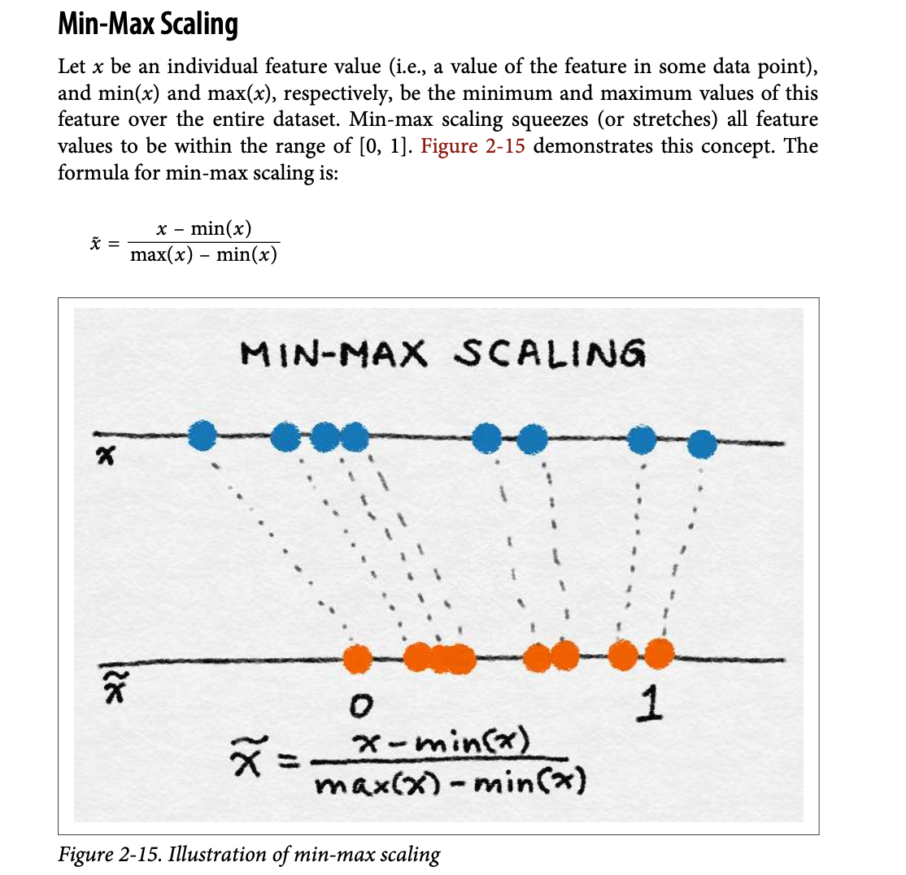

# 🚀 Day 23/333 – Normalization (Min-Max Scaling)

**Topic:** Data Preprocessing – Normalization  
  

---

## Objective
Learned how to apply **Min-Max normalization** to rescale feature values into a common range, improving ML model performance and comparability.

---

## Dataset
- **Wine dataset** (`wine_data.csv`)  
- Features used: `Alcohol`, `Malic Acid`  
- Target: `class label`

---

## Steps Taken
1. **Load and Inspect Dataset** using Pandas  
2. **Visualize Feature Distribution** using Seaborn KDE plots  
3. **Train-Test Split** (70% train, 30% test)  
4. **Apply Min-Max Scaling** using `sklearn.preprocessing.MinMaxScaler`  
5. **Compare Before vs After Scaling** with scatterplots  

---

### My today's Outcome:

-Features are now in the same range, making them ready for ML models
-Visual comparison clearly shows the effect of normalization

