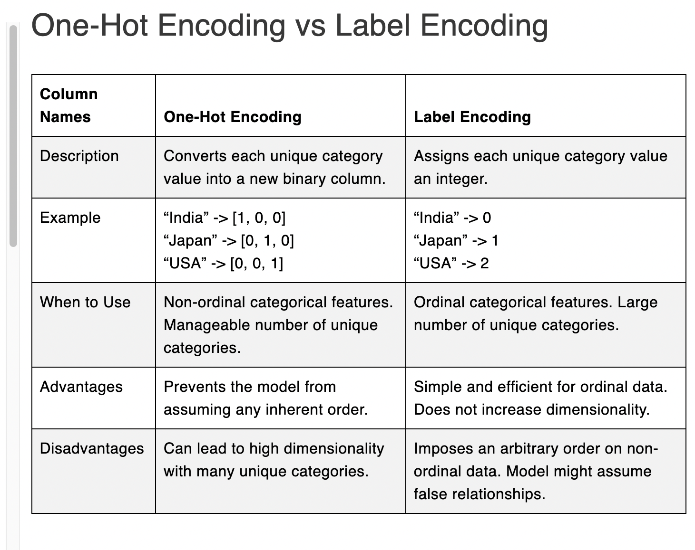

# 🚀 Day 21/333 – Encoding Categorical Data (One-Hot & Label Encoding)

## 📌 Overview
**Encoding Categorical Data** is the process of **converting text-based categorical features into numeric form** so that machine learning models can understand them.  

---

## 🔹 What I Learned Today

### 1. Why Encoding is Important
- ML models **cannot understand text**.  
- Categorical features like `Gender`, `Country`, `Size` must be transformed into numeric values.  
- Encoding ensures models can process these variables correctly.

---

### 2. Types of Encoding

#### A) Label Encoding
- Converts categories into **unique integers**.  
- Best for **ordinal data** (with logical order, e.g., `Small < Medium < Large`).  
-  Not suitable for **nominal data** as it may imply a false order.  

### B) One-Hot Encoding 

It creates **binary columns (0/1)** for each category in a column.

- Best for **nominal data** (categories with no order).  
- Examples: `Country`, `Color`, `Genre`.  
- Avoid for ordinal data (e.g., `Small < Medium < Large`), where Label Encoding is better.  

