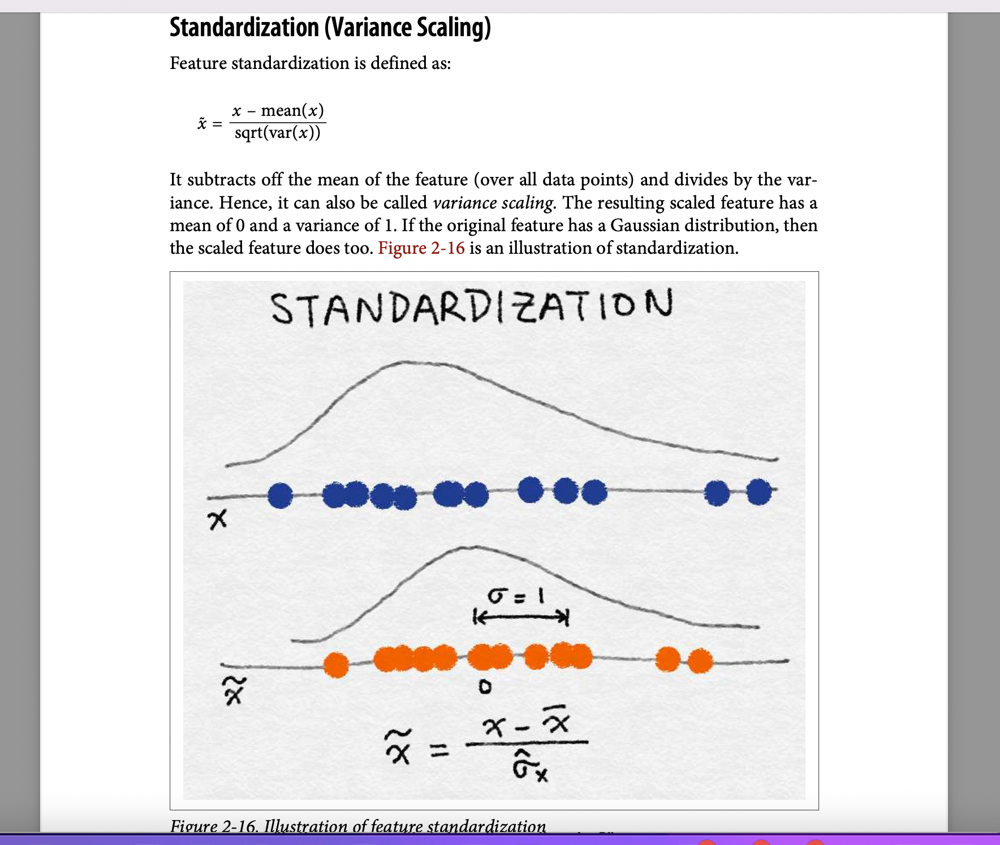

##  🚀 Day 22/333 Standardization in Data Preprocessing

**Objective:**  
Learn how to scale numerical features using **Standardization (Z-score Scaling)** to ensure fair contribution of all features in machine learning models.

---

## 🔍 Key Concept
Standardization transforms numerical features so that they have:  
- **Mean = 0**  
- **Standard Deviation = 1**  

This makes all features **comparable**, preventing features with large ranges from dominating the model.

---

## 📌 Why It Matters
- Ensures fair contribution of each feature  
- Speeds up model training and convergence  
- Essential for algorithms like **Logistic Regression, SVM, PCA, and Neural Networks**  
- Preserves original information while putting all features on an **even playing field**

---

## 🛠 Tools Used
- Python: Pandas, NumPy, Scikit-learn (StandardScaler)  

---

## ✅ Task Completed
- Standardized Titanic dataset features: `Age` and `Fare`  
- Compared statistics **before and after scaling**  
- Observed how standardization centers data around 0 and scales it by standard deviation

---

**Key Takeaway:**  
Standardization is a simple yet powerful preprocessing step that ensures machine learning models train efficiently and fairly across all numerical features.

 ]