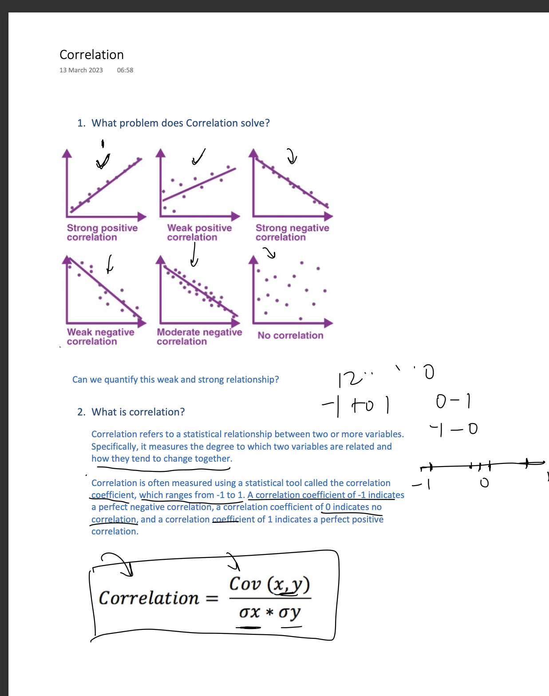

# 🌟 Day 28/333 – Correlation

 I explored **correlation** to understand how features in a dataset are connected and how these insights can guide better analysis and model building.

- **Understanding Correlation:** Reveals relationships between features.  
- **Avoiding Multicollinearity:** Helps prevent redundancy in models and improves performance.  
- **Types of Correlation:**  
  - **Pearson Correlation:** Measures linear relationships.  
  - **Spearman Correlation:** Captures monotonic (rank-based) relationships.  
- **Visualization:** Used **Seaborn heatmaps** to easily spot correlations.  
- **Example Insight:** Observed how **temperature** and **humidity** relate to **electricity demand**.  
- **Important Note:** Correlation shows **patterns**, but **does not imply causation**.

