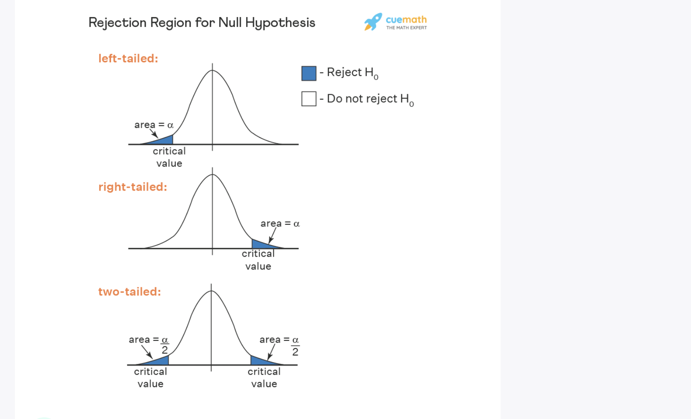

# Day 32/333 – Hypothesis Testing (Z-Test)

Explored **Z-Tests**, a key concept in hypothesis testing. Z-Tests help determine if a **sample mean significantly differs from a known population mean**, which is essential for making data-driven decisions.

## Key Points Learned
- **Purpose:** Check if a sample mean differs from the population mean  
- **Significance:** p-value < 0.05 → reject the null hypothesis (H₀)  
- **Requirements:** Known population standard deviation (σ) & large sample size  
- **Z-Statistic:** Measures how far the sample mean is from the population mean  
- **Test Type:** One-tailed or two-tailed  
- **Practical Example:** Testing if a new manufacturing machine affects product weight

Z-Tests allow us to **validate experiments**, make **data-driven decisions**, and determine whether observed differences are due to chance or truly significant.

